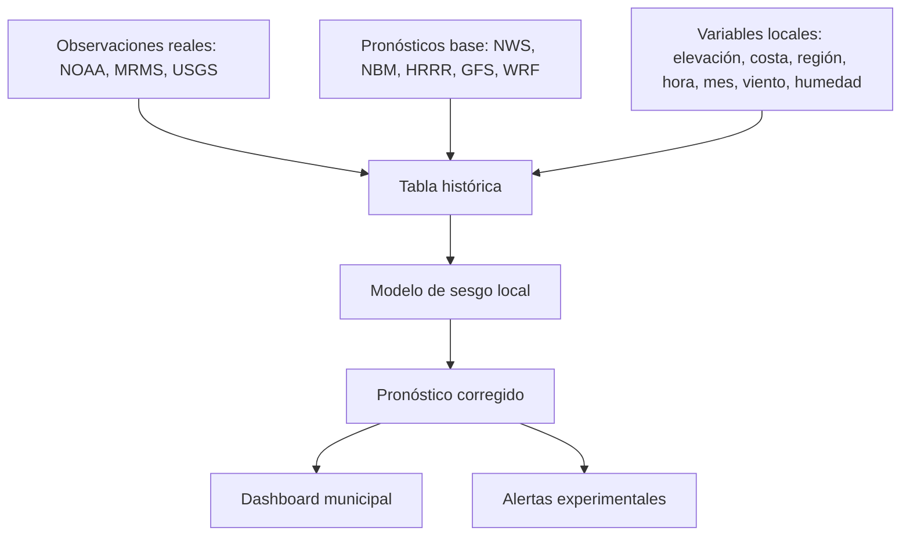

# Arquitectura recomendada para un modelo meteorológico local de Puerto Rico

## 1. Problema técnico

Puerto Rico requiere una capa de corrección local porque los modelos generales no siempre resuelven bien la combinación de topografía, brisa marina, convección de tarde, humedad tropical, polvo del Sahara, ondas tropicales y efectos costeros. El modelo debe aprender errores históricos por región y corregir el pronóstico base.

## 2. Arquitectura

## 3. Modelo mínimo viable

Primera versión recomendada:

- Target: lluvia observada en 24 horas.
- Pronóstico base: lluvia pronosticada por NWS/NBM/WRF o un proxy inicial.
- Corrección: modelo de machine learning para predecir `observado - base`.
- Salida: lluvia corregida + riesgo de lluvia fuerte.

## 4. Variables prioritarias

- `base_precip_24h_in`
- `base_temp_f`
- `relative_humidity`
- `pw_in` o agua precipitable
- `wind_speed_mph`
- `wind_dir_deg`
- `dust_index`
- `lat`, `lon`
- `elevation_m`
- `coastal`
- `region`
- `month`, `hour`

## 5. Regiones climáticas recomendadas

- Costa norte
- Costa sur
- Oeste
- Este/El Yunque
- Cordillera Central
- Área metro San Juan

## 6. Validación

El modelo debe validarse por región, no solo para toda la isla. Métricas recomendadas:

- MAE
- RMSE
- Bias
- POD
- FAR
- CSI

## 7. Recomendación operacional

No producir un solo pronóstico para toda la isla. Producir pronósticos por punto o municipio y luego interpolar a una cuadrícula de 1–3 km. Las alertas deben incluir incertidumbre.
